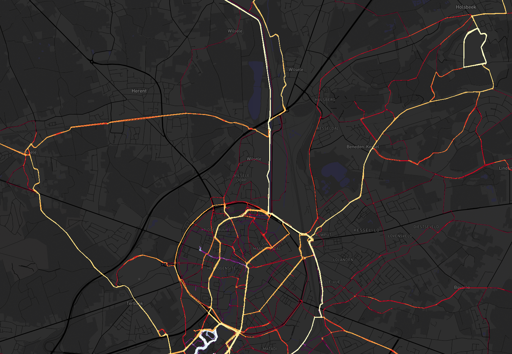
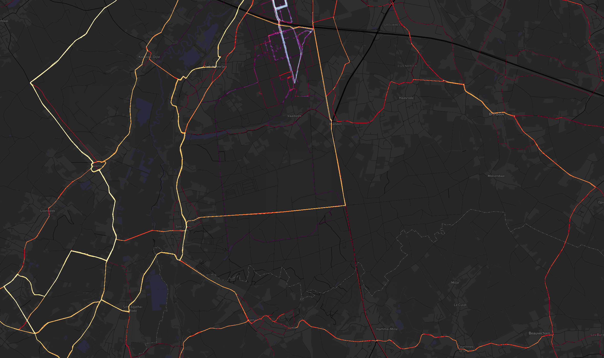

# Heatmap toolset
## Overview
This repository contains a notebook designed to create a heatmap from exported data from Strava.
It is also possible to create a heatmap from just a collection of gpx files.

To generate the background maps, the notebook relies on mapbox. You will need your own API key to generate these maps.



## Features
The coloring is split in a linear part, and a part based on an inverse cdf. The inverse cdf prevents getting a few very bright points where a lot of activities pass and all the rest at the dark tracks.
Instead, each color in the colormap should appear more or less the same amount on the map.
It is possible to pick different colormaps for different activitytypes.


 For example, in both examples the red-yellow colormap represents cycling, the purple-blue colormap running and walking.

## Instalation
A python 3.x version with the following packages is required:
```
jupyterlab, pandas, numpy, cartopy, matplotlib, gpxpy, geopy
```
The easiest way is to install anaconda or miniconda. Install the following packages with `conda install`:
```
jupyterlab, pandas, numpy, cartopy, matplotlib
```
The following packages are not available in anaconda, but can be installed via `pip install`:
```
gpxpy, geopy
```

## Usage
Basic usage:
- start `jupyter lab`
- Navigate to this folder
- Download your data from Strava and unzip the archive in the same folder as this readme
- Open the notebook `notebooks/heatmap-gen.ipynb` and follow the instructions there